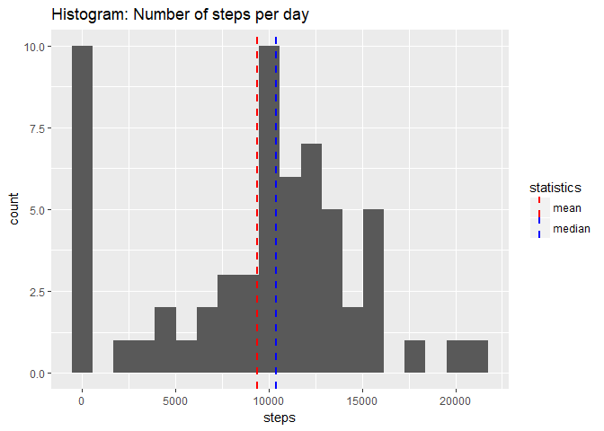
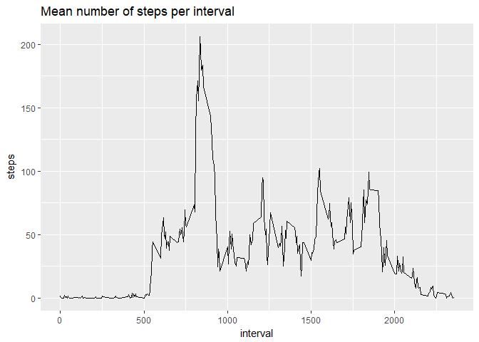
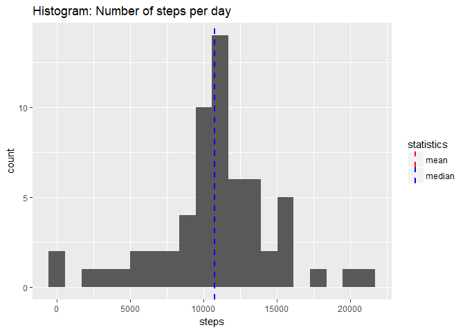
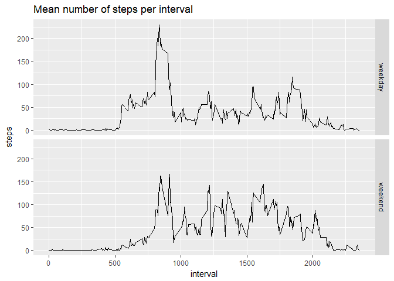

## Loading and preprocessing the data

We read the data directly from the zip file. To do so, we use the "readr" library.
Each column is properly assigned to the right class (num/data/num), so no futher processing is needed.


```r
require(readr)
```

```
## Loading required package: readr
```

```r
library(data.table)
library(ggplot2)
options(scipen=999)
dt <- data.table(read_csv("activity.zip"))
```

```
## Parsed with column specification:
## cols(
##   steps = col_double(),
##   date = col_date(format = ""),
##   interval = col_double()
## )
```


## What is mean total number of steps taken per day?

We calculate the total number of steps using a data table.


```r
#Total number of steps per day
steps.per.day <- dt[,sum(steps,na.rm=TRUE),date]
names(steps.per.day)[2] <- "steps"
#Mean and median
mean.steps <- mean(steps.per.day$steps,na.rm=TRUE)
median.steps <- median(steps.per.day$steps,na.rm=TRUE)
#Histogram
ggplot(steps.per.day,aes(steps)) +
  geom_histogram(bins=20) +
  geom_vline(aes(xintercept=mean(steps),color="mean"), linetype="dashed", size=1) + 
  geom_vline(aes(xintercept=median(steps), color="median"), linetype="dashed", size=1 ) +
  ggtitle("Histogram: Number of steps per day") +
  scale_color_manual(name = "statistics", values = c(median = "blue", mean = "red"))
```

<!-- -->

The mean number of steps across days is ``9354`` and the median is ``10395``.

## What is the average daily activity pattern?

Again, we use a data table to average and "group by".


```r
#Time series plot (type = "l") of the 5-minute interval (x-axis) and the average number of steps taken, averaged across all days (y-axis)
steps.per.interval <- dt[,mean(steps,na.rm=TRUE),interval]
names(steps.per.interval)[2] <- "steps"
ggplot(steps.per.interval,aes(interval,steps)) + 
  geom_line(size=0.5) +
  ggtitle("Mean number of steps per interval")
```

<!-- -->

```r
#Which 5-minute interval, on average across all the days in the dataset, contains the maximum number of steps?
interval.max <- steps.per.interval$interval[which.max(steps.per.interval$steps)]
```

The interval ``835`` contains the maximum number of steps.

## Imputing missing values

We will replace NA by the average steps for the same interval over all the days.


```r
#Number of rows with missing values (all the values come from the column "steps")
missing <- sum(!complete.cases(dt))
#Imputation: impute for each interval the average of that interval
#Create a new dataset that is equal to the original dataset but with the missing data filled in.
dt.complete <- merge(dt,steps.per.interval,by="interval")
dt.complete$steps <- ifelse(!is.na(dt.complete$steps.x),dt.complete$steps.x,dt.complete$steps.y)
dt.complete<-dt.complete[,.(steps,date,interval)]

#Histogram of number of steps per day
steps.per.day2 <- dt.complete[,sum(steps),date]
names(steps.per.day2)[2] <- "steps" 
mean.steps2 <- mean(steps.per.day2$steps)
median.steps2 <- median(steps.per.day2$steps)
ggplot(steps.per.day2,aes(steps)) +
  geom_histogram(bins=20) +
  geom_vline(aes(xintercept=mean(steps),color="mean"), linetype="dashed", size=1) + 
  geom_vline(aes(xintercept=median(steps), color="median"), linetype="dashed", size=1 ) +
  ggtitle("Histogram: Number of steps per day") +
  scale_color_manual(name = "statistics", values = c(median = "blue", mean = "red"))
```

<!-- -->
The mean number of steps across days after imputing missing values is ``10766`` and the median is ``10766``. Mean and median are now the same.

The variation of both parameters after the imputation is:

- mean: ``9354`` --> ``10766``
- median: ``10395`` --> ``10766``


## Are there differences in activity patterns between weekdays and weekends?

We plot the activity patterns separately for weekdays and weekends. There are some differences between both patterns.


```r
#Create a new factor indicating weekday or weekend
library(lubridate) 
```

```
## 
## Attaching package: 'lubridate'
```

```
## The following objects are masked from 'package:data.table':
## 
##     hour, isoweek, mday, minute, month, quarter, second, wday,
##     week, yday, year
```

```
## The following object is masked from 'package:base':
## 
##     date
```

```r
dt.complete[,type.of.day:=as.factor(ifelse( wday(date)>1 & wday(date)<7,"weekday","weekend"))]  
#Time series plot (type = "l") 
steps.per.interval2 <- dt.complete[,mean(steps,na.rm=TRUE),.(type.of.day,interval)]
names(steps.per.interval2)[3] <- "steps"
ggplot(steps.per.interval2,aes(interval,steps)) + 
  geom_line(size=0.5) +
  facet_grid(type.of.day ~ .) +
  ggtitle("Mean number of steps per interval")
```

<!-- -->

